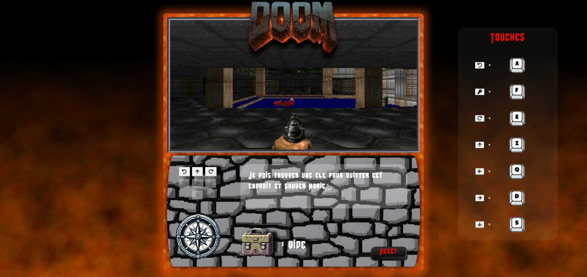
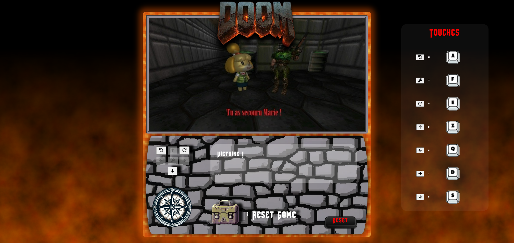

# 🔫 Projet Serval - DooM Like ( Save Marie ) 

## Projet de vue à la première personne

Ce projet vise à créer une application de vue à la première personne, souvent appelée vision subjective, où l'utilisateur contrôle un avatar explorant un environnement comme s'il voyait la scène à travers les yeux de son personnage.
<br/>
Projet demander au sein de notre formation proposée par <a href = 'https://www.onlineformapro.com/' target = "_blank" >OnlineFormaPro.</a>

### Partie 1

La partie 1 de l'application implémente la vue à la première personne avec la gestion des mouvements de l'avatar dans un environnement représenté par des images. Voici une brève description des composants et des fonctionnalités :

- **Classes principales :** `FirstPersonView` et `FirstPersonText` héritent de `BaseClass`, qui gère les fonctionnalités de base de l'avatar.
- **Base de données :** La base de données "fpview" contient trois tables pour stocker les informations sur la carte, les images et les textes.
- **Layout :** L'écran est divisé en trois parties : la vue à la première personne, la zone de gestion des mouvements et la carte stockée en base de données.
- **Boussole :** Une boussole indique la direction de la vue de l'avatar.
- **Interaction avec la base de données :** Les coordonnées et l'angle de vue de l'avatar sont utilisés pour interroger la base de données afin de récupérer les images et les textes correspondants.
- **Contrôle des mouvements :** Des boutons permettent à l'utilisateur de déplacer l'avatar vers l'avant, l'arrière, la droite ou la gauche, ainsi que de tourner à droite ou à gauche. Les mouvements ne sont possibles que s'ils sont autorisés dans la base de données.

### Partie 2

La partie 2 ajoute des fonctionnalités d'interaction avec l'environnement, telles que la prise d'objets et leur utilisation. Voici les principales modifications et ajouts :

- **Actions :** Deux actions de base sont définies : "prendre" (take) et "utiliser" (use) des objets présents sur la carte.
- **Bouton d'action :** Un bouton central est activé lorsqu'une action est possible.
- **Base de données :** Les tables sont modifiées pour inclure des informations sur les actions et les objets.
- **Classe `FirstPersonAction` :** Cette classe spécialisée gère les actions de l'avatar, telles que la vérification et l'exécution des actions possibles.

### Ajouts récents

- **Bouton reset :** Un bouton "reset" a été ajouté pour permettre de remettre le joueur sur la case de départ et de vider la session.
- **Session :** L'inventaire de l'avatar est stocké dans une session PHP, qui est vidée lors de l'utilisation du bouton reset.

### Méthodologie

- **Conception :** Réalisation d'un MCD détaillé pour définir la structure de la base de données.
- **Implémentation de la base de données :** Création des tables et des relations selon le MCD.
- **Développement des classes :** Création des classes PHP pour gérer l'application.
- **Refactorisation du code :** Application du principe DRY pour éviter la répétition du code.
- **Intégration HTML/CSS :** Création du layout de l'application avec les composants nécessaires.

## Installation

1. Clonez le dépôt :

```bash
git clone https://github.com/florentbaccard/Projet_SERVAL.git
```

## Captures d'écran



